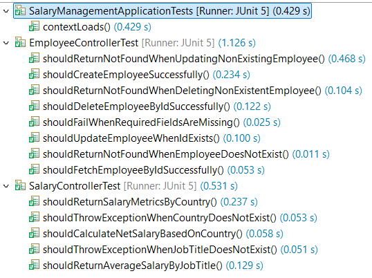

# 💼 Salary Management System

A Spring Boot-based **Salary Management System** that efficiently handles employee data and computes salary metrics by employee, country, and job title.  
The system follows **Test-Driven Development (TDD), clean layered architecture**, ensuring scalability, modularity, and maintainability.

---

## 📘 Table of Contents
- [Overview](#-overview)
- [Key Features](#-key-features)
- [System Architecture](#-system-architecture)
- [Package Structure](#-package-structure)
- [API Endpoints](#-api-endpoints)
- [Test Cases Summary](#-test-cases-summary)
- [Setup Instructions](#-setup-instructions)
- [Author](#-author)

---

## 🧩 Overview
The **Salary Management System** allows you to:
- Manage employee records (Create, Read, Update, Delete).
- Calculate salary breakdown including TDS and Net Salary.
- Retrieve salary metrics based on **country** or **job title**.
- Handle validation and exceptions with meaningful responses.
- Maintain robust unit and integration tests for reliability.

---

## 🚀 Key Features

- Employee CRUD operations  
- Salary calculation (gross, TDS, and net salary)  
- Salary metrics by country (min, max, average)  
- Average salary by job title  
- Input validation using Jakarta Validation  
- Centralized exception handling  
- Unit and integration tests with JUnit 5 and MockMvc  

---

## 🏗️ System Architecture

The application follows a **multi-layered architecture**:
## 🧩 Layered Architecture

| Layer&nbsp;&nbsp;&nbsp;&nbsp;&nbsp;&nbsp;&nbsp;&nbsp;&nbsp;&nbsp;&nbsp;&nbsp;&nbsp;&nbsp;&nbsp;&nbsp;&nbsp;&nbsp;&nbsp;&nbsp;&nbsp; | Description&nbsp;&nbsp;&nbsp;&nbsp;&nbsp;&nbsp;&nbsp;&nbsp;&nbsp;&nbsp;&nbsp;&nbsp;&nbsp;&nbsp;&nbsp;&nbsp;&nbsp;&nbsp;&nbsp;&nbsp;&nbsp;&nbsp;&nbsp;&nbsp;&nbsp;&nbsp;&nbsp;&nbsp;&nbsp;&nbsp;&nbsp;&nbsp;&nbsp;&nbsp;&nbsp;&nbsp;&nbsp;&nbsp;&nbsp;&nbsp;&nbsp;&nbsp;&nbsp;&nbsp;                               |\
| -------------------- | ------------------------------------------ -|\
| **Controller**&nbsp;&nbsp;&nbsp;&nbsp;&nbsp;&nbsp;&nbsp;&nbsp;&nbsp;&nbsp;&nbsp;&nbsp;&nbsp;       | Handles HTTP requests and responses.      |\
| **Service** &nbsp;&nbsp;&nbsp;&nbsp;&nbsp;&nbsp;&nbsp;&nbsp;&nbsp;&nbsp;&nbsp;&nbsp;&nbsp;&nbsp;&nbsp;&nbsp;&nbsp;          | Contains business logic. &nbsp;&nbsp;&nbsp;&nbsp;&nbsp;&nbsp;&nbsp;&nbsp;&nbsp;&nbsp;&nbsp;&nbsp;&nbsp;&nbsp;&nbsp;&nbsp;&nbsp;&nbsp;&nbsp;&nbsp;&nbsp;&nbsp;&nbsp;                 |\
| **Repository**  &nbsp;&nbsp;&nbsp;&nbsp;&nbsp;&nbsp;&nbsp;&nbsp;&nbsp;&nbsp;&nbsp;      | Interacts with the database using JPA.  &nbsp;&nbsp;  |\
| **Model/Entity**&nbsp;&nbsp;&nbsp;&nbsp;&nbsp;&nbsp;&nbsp;&nbsp;      | Represents the database structure.   &nbsp;&nbsp;&nbsp;&nbsp;&nbsp;&nbsp;&nbsp;     |\
| **DTO**&nbsp;&nbsp;&nbsp;&nbsp;&nbsp;&nbsp;&nbsp;&nbsp;&nbsp;&nbsp;&nbsp;&nbsp;&nbsp;&nbsp;&nbsp;&nbsp;&nbsp;&nbsp;&nbsp;&nbsp;&nbsp;&nbsp;&nbsp;               | Transfers structured data between layers.|\
| **Exception Handler** | Handles and formats errors globally.&nbsp;&nbsp;&nbsp;&nbsp;&nbsp;&nbsp;      |

---

## 📂 Package Structure


```
com.incubyte.SalaryManagement
│
├──SalaryManagementApplication
│
├── controller
│   ├── EmployeeController.java
│   └── SalaryController.java
│
├── service
│   ├── EmployeeService.java
│   └── SalaryService.java
│
├── repository
│   ├── EmployeeRepository.java
│   └── SalaryRepository.java
│
├── dto
│   ├── EmployeeDto.java
│   ├── ErrorResponseDto
│   ├── SalaryBreakupDto.java
│   └── SalaryMetricsDto.java
│
├── model
│   └── Employee.java
│
├── exception
│   ├── GlobalExceptionHandler.java
│   ├── EmployeeNotFoundException.java
│   ├── JobTitleNotFoundException.java
│   └── CountryNotFoundException.java
│
└── test
    ├── EmployeeControllerTest.java
    └── SalaryControllerTest.java
```
---
## 🧾 API Endpoints

### 👤 Employee Service
- **POST** `/api/v1/employeeService/createEmployee` — Create a new employee  
- **GET** `/api/v1/employeeService/getEmployeeById/{id}` — Get employee by ID  
- **PUT** `/api/v1/employeeService/updateEmployee/{id}` — Update an existing employee  
- **DELETE** `/api/v1/employeeService/deleteEmployee/{id}` — Delete an employee by ID  

### 💰 Salary Service
- **POST** `/api/v1/salaryService/calculateSalary` — Calculate salary breakup for an employee  
- **GET** `/api/v1/salaryService/metrics/country/{country}` — Get min, max, and average salary by country  
- **GET** `/api/v1/salaryService/metrics/jobTitle/{title}` — Get average salary by job title  

---
## 🧪 Test Cases Summary

### ✅ EmployeeControllerTest
- `shouldCreateEmployeeSuccessfully()` — Verify employee creation  
- `shouldFailWhenRequiredFieldsAreMissing()` — Validate missing field handling  
- `shouldFetchEmployeeByIdSuccessfully()` — Fetch existing employee  
- `shouldReturnNotFoundWhenEmployeeDoesNotExist()` — Handle non-existent employee fetch  
- `shouldUpdateEmployeeWhenIdExists()` — Update existing employee  
- `shouldReturnNotFoundWhenUpdatingNonExistingEmployee()` — Handle update failure  
- `shouldDeleteEmployeeByIdSuccessfully()` — Delete employee  
- `shouldReturnNotFoundWhenDeletingNonExistentEmployee()` — Handle delete failure  

### ✅ SalaryControllerTest
- `shouldCalculateNetSalaryBasedOnCountry()` — Verify salary breakup computation  
- `shouldReturnSalaryMetricsByCountry()` — Verify min/max/avg salary by country  
- `shouldThrowExceptionWhenCountryDoesNotExist()` — Handle invalid country  
- `shouldReturnAverageSalaryByJobTitle()` — Verify avg salary by job title  
- `shouldThrowExceptionWhenJobTitleDoesNotExist()` — Handle missing job title  


  
*Test Cases*
---

## ⚙️ Setup Instructions

### 🌀 Clone the Repository
```bash
git clone https://github.com/saurabhkumarr99/Salary-Management
cd SalaryManagement
```
🏗️ Build and Run the Application
```bash
mvn clean install
mvn spring-boot:run
```
🌐 Access APIs
```bash
http://localhost:8080/api/v1/employeeService
http://localhost:8080/api/v1/salaryService
```
---
## 💡 AI Assistance

Throughout the development of this project, **AI tools (ChatGPT - GPT-5)** were used to enhance productivity and maintain best practices.  
Specifically, AI was utilized for the following tasks:

- 🧩 Assisting in **setting up SQLite database** configuration within the Spring Boot application.  
- 🏷️ Providing **nomenclature suggestions** for classes, methods, and packages to maintain clean code structure.  
- 🧪 Supporting in **resolving a few complex test case issues** and refining test assertions for `MockMvc` and JUnit 5. 
- 📘 Helping in the **creation of detailed README.md documentation**, including structured sections and formatting.  
 

---
### ✍️ Author

**Saurabh Rai**  
Software Developer | Java | Spring Boot | Microservices | Docker  
📝 Linkedin: [Saurabh Kumar Rai](https://www.linkedin.com/in/saurabh-kumar-rai-36531a222/)  
🐙 GitHub: [Saurabh Kumar Rai](https://github.com/saurabhkumarr99)
